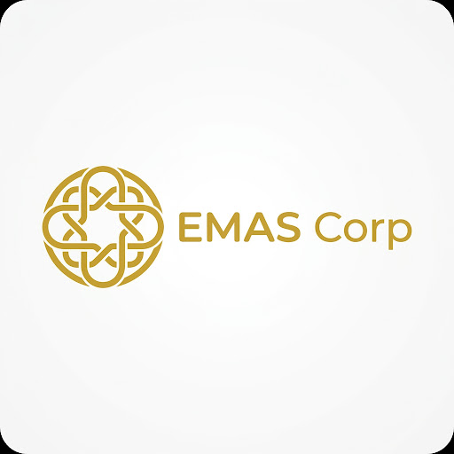

<div align="center">
  
  <br><br>
  <a href="https://gialangcahyapupdite.github.io/DEMO/">
    
  </a>
</div>

<br>

# EMAS Corp - Company Profile Website

Website company profile untuk **PT Era Mulia Abadi Sejahtera (EMAS Corp)** yang dirancang dengan orientasi tampilan premium, elegan, responsif, dan sangat interaktif. Proyek ini menonjolkan profesionalisme perusahaan melalui desain antarmuka modern dan animasi dinamis.

## Bahasa Pemrograman & Teknologi yang Digunakan

Proyek ini murni berbasis **Frontend (Client-Side)** dan dibangun tanpa memerlukan *build-tools* yang kompleks sehingga mudah dikelola dan dimodifikasi:

*   **HTML5**
    Digunakan untuk membangun struktur dan kerangka semantik dasar halaman website.
*   **CSS3 & Tailwind CSS (via CDN)**
    Menggunakan pendekatan kerangka kerja *utility-first* Tailwind CSS untuk memastikan tampilan yang estetik, konsisten, dan responsif (*Mobile, Tablet, Desktop*). Termasuk implementasi efek *glassmorphism*, bayangan, dan transisi halus.
*   **Vanilla JavaScript (ES6)**
    Digunakan untuk mengatur interaktivitas halaman secara murni. Fungsionalitas JS meliputi:
    *   *Intersection Observer* untuk animasi transisi *fade-in* saat pengguna menggulir halaman.
    *   Sistem pergeseran *Slideshow / Carousel* untuk bagian "Business Insights".
    *   Efek cahaya dinamis (*Mouse Follower*) yang bereaksi mengikuti kursor pengguna.
    *   Animasi hitungan (*Count-up counter*) dinamis pada statistik pencapaian.

---

## Struktur Direktori Proyek

```text
/
├── css/
│   └── style.css            # Pengaturan CSS kustom, interaksi kursor, dan animasi keyframes
├── img/                     # Berisi semua gambar aset lokal (logo, galeri, dsb.)
├── js/
│   ├── main.js              # Script logika interaksi, carousel, observer, dan efek mouse
│   └── tailwind-config.js   # Konfigurasi kustom tema, warna emas/navy, dan font Tailwind
├── index.html               # File utama untuk memuat kerangka halaman website utama
├── galeri.html              # Halaman Galeri khusus (Dikelompokkan berdasarkan Unit Bisnis)
├── galeri-*.html            # 5 halaman sub-galeri (food, fashion, financial, fun-lifestyle, property)
├── career.html              # Halaman portal karir dan lowongan pekerjaan
├── login.html               # Halaman login admin portal
└── admin.html               # Halaman dashboard admin portal
```

## Cara Menjalankan Secara Lokal

Proyek ini siap pakai (*Plug & Play*). 
1. *Clone* atau unduh (*Download*) repository ini ke komputer Anda.
2. Buka folder proyek, lalu klik ganda (*double-click*) pada file `index.html` atau `galeri.html`.
3. Website akan terbuka langsung melalui browser (Google Chrome, Firefox, Safari, dsb.) dengan seluruh fitur dan animasi yang berfungsi penuh. 

Tidak memerlukan instalasi Node.js, server PHP, atau konfigurasi *Localhost* apa pun.

---

## Fitur-Fitur Utama & Pembaruan Terbaru (Update)

Website ini telah dioptimalkan secara komprehensif dengan berbagai fitur interaktif untuk memanjakan mata pengunjung (User Experience yang maksimal):

1. **Responsive Design (Desain Adaptif Penuh)**
   Tata letak (*layout*) otomatis menyesuaikan secara sempurna dengan ukuran layar apa pun. Dari layar *Smartphone*, Tablet, hingga monitor lebar Desktop.
   
2. **Halaman Galeri Terstruktur (Bento Grid) & Sub-Galeri**
   Terdapat halaman terpisah khusus galeri (`galeri.html`) yang dikelompokkan dengan sangat rapi ke dalam 5 Pilar Bisnis Utama. Masing-masing pilar kini memiliki halaman dedikasi tersendiri:
   *   `galeri-food.html` (Food & Beverage)
   *   `galeri-fashion.html` (Fashion)
   *   `galeri-financial.html` (Financial Services)
   *   `galeri-fun-lifestyle.html` (Fun & Lifestyle)
   *   `galeri-property.html` (Property & Real Estate)

3. **Portal Karir (Career Page)**
   Halaman khusus `career.html` yang menampilkan peluang berkarir di EMAS Corp, lengkap dengan daftar lowongan pekerjaan yang tersedia, nilai budaya perusahaan, dan form/tombol aplikasi interaktif.

4. **Sistem Portal Admin (Login & Dashboard)**
   Terdapat fitur purwarupa portal manajemen (*Admin Portal*):
   *   `login.html`: Halaman otentikasi admin dengan desain *glassmorphism* premium dan validasi dinamis.
   *   `admin.html`: *Dashboard* interaktif untuk mengelola data karir, lowongan, dan pelamar dengan navigasi *sidebar* modern.

5. **"Our Principles" & "Our Impact" Interactive Sections**
   Dua bagian pilar utama perusahaan yang dilengkapi dengan efek interaktif *Hover* (Pantulan/Jump). Saat kursor diarahkan, elemen akan terangkat, memunculkan bayangan (*shadow-xl*), dan warnanya akan berganti menjadi Biru Gelap/Emas eksklusif khas EMAS Corp.

6. **Dynamic Business Insights (Quotes Carousel)**
   Bagian interaktif yang menampilkan kompilasi kebijaksanaan (*Wisdom from The Founder*). Komponen ini bergeser otomatis (*auto-slide*) secara cerdas menyesuaikan ukuran layar.

7. **Rich Micro-Animations & Hover States**
   Setiap kartu "Unit Bisnis" dan tombol pada website memiliki efek *micro-animations*. Elemen akan melayang terangkat (*translate-y*), bayangan semakin dalam, dan warna tema merespons interaksi kursor.

8. **Integrasi Peta Dinamis (Google Maps)**
   Bagian Hubungi Kami ("Let's Build Together") dilengkapi dengan peta interaktif (*iframe* Google Maps) untuk memudahkan pengunjung melacak lokasi perusahaan dengan akurat.

9. **Animated Count-up Statistics**
   Bagian metrik kesuksesan perusahaan (Pencapaian) akan melakukan animasi penghitungan angka dinamis (dari 0 ke angka aktual) secara tepat pada saat bagian tersebut masuk ke dalam layar pandang.
